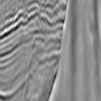
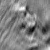
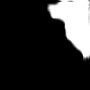
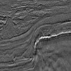

# Salt

I running a custom Unet neural network to make image segmentation on TGS Salt dataset.

I wrote the code and made only one change - I changed the learning rate from 0.001 to 0.0001 to get the following results.

image|mask|prediction
:----|:--:|:---------
||
||
||
||

I didn't try to change neural network architecture and hyperparameter tuning and because of that, the results could be better.
